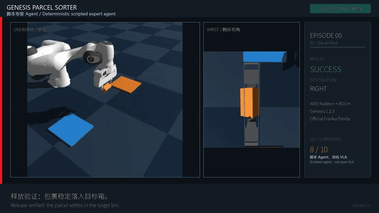
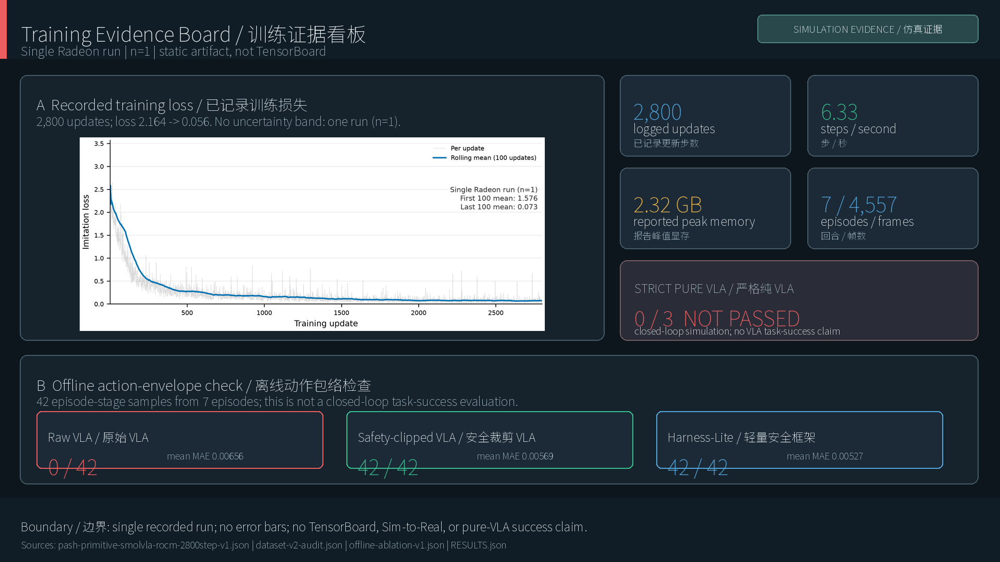
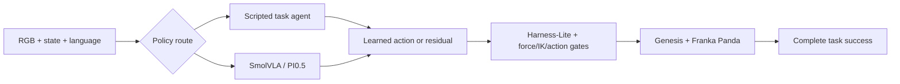

# Parcel Sorter ROCm / ROCm 包裹分拣

**Development/robot boundary.** **GPT-5.6 Luna** is the development and
orchestration Agent used for engineering and evidence work. It is not a robot
reasoning or control model. The successful video is executed by
`ScriptedPickPlaceExpert + ClosedLoopSupervisor`; hybrid VLA is reported
separately, and strict pure VLA remains 0/3, not passed.




This project started with an uncomfortable result: training loss went down,
but the robot still failed in closed loop. We therefore built the submission
around a simpler rule: every success clip, checkpoint and metric must say which
controller produced it.

这个项目起因很直接：训练 loss 在下降，但机器人闭环仍然失败。因此我们没有把
不同实验混成一个“成功率”，而是要求每段视频、每个 checkpoint 和每项指标都能
追溯到实际控制器。

The system runs parcel pick-and-place in Genesis on one AMD Radeon GPU through
ROCm. It includes a deterministic task agent, SmolVLA and PI0.5 research paths,
and an agent-guided VLA safety harness. The 59-second video contains eight
successful **scripted-agent** episodes. Strict pure VLA was evaluated separately
and scored **0/3**.

系统在单张 AMD Radeon GPU 上通过 ROCm 运行 Genesis 包裹抓取与分拣。仓库包含
确定性任务 agent、SmolVLA/PI0.5 研究路径，以及 agent 引导的 VLA 安全框架。
59 秒视频展示 8 个成功的**脚本 agent** 回合；严格纯 VLA 单独评测，结果为
**0/3**。

[Demo MP4](videos/genesis_panda_8_success_reference_demo.mp4) ·
[PR #119](https://github.com/AMD-DEV-CONTEST/Radeon-hackathon-2026-07/pull/119) ·
[Agent/model/API architecture](docs/AGENT_MODEL_ARCHITECTURE.md) ·
[Training evidence](docs/TRAINING_EVIDENCE.md) ·
[Markdown review index / Markdown 审阅索引](docs/MD_REVIEW_INDEX_EN_CN.md)

**Evidence and release / 证据与发布：**
[Ablation / 消融](docs/ABLATION_RESULTS.md) ·
[Dataset card / 数据卡](docs/DATASET_CARD.md) ·
[Hugging Face upload guide / 上传指南](data/HUGGINGFACE_UPLOAD_GUIDE_EN_CN.md) ·
[Sim-to-Real status and protocol / 状态与协议](docs/SIM_TO_REAL_STATUS.md) ·
[Technical blog and social copy / 技术博客与社交文案](docs/TECHNICAL_BLOG_AND_SOCIAL_EN_CN.md)



**Contents / 目录**

- [1. Project Overview / 项目简介](#overview)
- [2. Development Process / 开发过程](#development)
- [3. Source Attribution / 代码来源说明](#attribution)
- [4. Team Roles / 团队分工](#team)
- [5. Install and Run / 安装与运行](#install)

<a id="overview"></a>
## 1. Project Overview / 项目简介

### What the system does / 系统做什么

A randomized box appears on the work surface and is assigned to the left or
right destination. The controller must approach, grasp, lift, transport and
release it inside the requested area. Genesis supplies rigid-body physics and
the Franka Panda model; the project supplies task randomization, policy
adapters, the task supervisor, safety gates, recording and evaluation.

工作台上随机出现一个长方体包裹，并指定左侧或右侧目标区。控制器需要完成接近、
抓取、抬升、搬运和释放。Genesis 提供刚体物理与 Franka Panda 模型，本项目负责
任务随机化、策略适配、任务状态机、安全门、录制和评测。



The hybrid route is genuinely agent + VLA: the scripted agent supplies task
phase and a nominal motion, while the learned policy proposes a bounded action
or residual. Harness-Lite verifies progress and safety before execution. The
successful demo video, however, uses the scripted route alone; the hybrid result
reported here is an offline action-envelope study, not closed-loop task success.

混合路径确实是 agent + VLA：脚本 agent 提供任务阶段和名义运动，学习策略提出
受限动作或残差，Harness-Lite 在执行前检查进度与安全。但成功视频使用的是纯脚本
路径；本次提交中的混合结果是离线动作包络实验，不是闭环任务成功率。

Full model names, APIs and process boundaries are documented in
[Agent, Model, API and Architecture](docs/AGENT_MODEL_ARCHITECTURE.md).

### What we measured / 实际测了什么

| Track | Result | Interpretation |
| --- | ---: | --- |
| Scripted task agent | **8/10** successful trajectories | Uses privileged Genesis state; source of the demo clips and teaching trajectories |
| Raw SmolVLA action envelope | **0/42** valid samples | Learned actions exceeded at least one frozen execution limit |
| Safety-clipped VLA / Harness-Lite | **42/42** valid samples | Offline action validity only |
| Strict pure VLA closed loop | **0/3** complete tasks | Failed; no expert completion or fallback was credited |

The audited primitive dataset contains **7 independent episodes** and **4,557
frames** at 30 Hz, with overhead RGB, a 43-D non-privileged state and a 20-D
action contract. See [data/README.md](data/README.md) and
[result attribution](docs/RESULT_ATTRIBUTION.md).

经审计的数据集包含 **7 个独立 episode、4,557 帧**，采样率 30 Hz，包含俯视
RGB、43 维非特权状态和 20 维动作合约。详情见
[数据说明](data/README.md)与[结果归因](docs/RESULT_ATTRIBUTION.md)。

### Stack / 技术栈

| Component | Recorded version |
| --- | --- |
| GPU runtime | AMD Radeon `gfx1100`, ROCm 7.2.1 |
| Learning runtime | PyTorch 2.9.1 ROCm, LeRobot 0.6.1, Python 3.12 |
| Simulation | Genesis 1.2.3, Franka Panda MJCF |
| Rates | Physics 240 Hz, control 30 Hz, camera 10 Hz |

In this ROCm environment, PyTorch still names the HIP device `cuda:0`; this does
not mean that an NVIDIA CUDA runtime was used.

<a id="development"></a>
## 2. Development Process / 开发过程

### English

We first stabilized one fixed Panda workcell with a scripted pick-and-place
agent. That gave us a reproducible success condition (`Stage.COMPLETE`) and a
way to collect demonstrations without guessing whether a clip was successful.
Seven independent successful episodes were then converted into the primitive
dataset used by the 2,800-step SmolVLA run.

The first learned-policy check exposed the main problem: predicted actions
looked numerically close to the expert, but every one of the 42 frozen samples
violated at least one execution limit. We kept that failure, added explicit
Cartesian, force, IK and tool-command gates, and evaluated two bounded variants.
Both passed the offline envelope, but this did not prove that they could finish
the task.

We then ran a strict PI0.5 closed-loop smoke test with no expert completion.
All three trials failed. This is why the repository keeps three routes instead
of presenting one blended score: scripted demonstrations, hybrid safety
experiments and pure-VLA evaluation answer different questions.

Two engineering details mattered more than expected. Stock finger geometry was
unreliable for side contacts, so tool variants are generated from the locked
Panda MJCF instead of editing an untraceable asset copy. The Radeon container
and checkpoint revisions are also pinned because a generic PyTorch install can
silently select the wrong backend.

### 中文

我们先在固定 Panda 工作单元中稳定脚本抓放 agent，由此得到可重复的成功条件
`Stage.COMPLETE`，也能明确判断一段轨迹是否真的完成任务。随后把 7 个独立成功
回合整理成 primitive 数据集，用于 2,800 step 的 SmolVLA 训练。

第一次学习策略检查暴露了关键问题：预测动作在数值上接近专家，但冻结的 42 个
样本全部至少违反一项执行边界。我们保留这个失败结果，再加入笛卡尔、力、IK 和
工具指令安全门，对两个受限版本做离线比较。它们都通过了动作包络，但这并不等于
完成了抓放任务。

之后进行不允许专家补全的严格 PI0.5 闭环测试，3 次全部失败。因此仓库保留三条
独立路径：脚本示范、混合安全实验和纯 VLA 评测，三者回答的问题不同，不能合并
成一个看似好看的成功率。

工程上还有两个实际难点：原始手指几何在侧向接触时不稳定，因此工具变体从锁定
的 Panda MJCF 结构化生成；Radeon 容器和 checkpoint 版本也必须固定，否则通用
PyTorch 安装可能静默选择错误后端。

### Offline ablation / 离线消融

| Treatment | Mean MAE | Mean MSE | Envelope pass |
| --- | ---: | ---: | ---: |
| Expert executor | 0.00447 | 0.000422 | 42/42 |
| Raw VLA | 0.00656 | 0.000972 | 0/42 |
| Safety-clipped VLA | 0.00569 | 0.000434 | 42/42 |
| Harness-Lite | 0.00527 | 0.000427 | 42/42 |

Evidence is kept next to the code: [training log](evidence/training/pash-primitive-smolvla-rocm-2800step-v1.log),
[curve](docs/assets/pash-primitive-smolvla-2800step-training-curve-v1.png),
[ablation JSON](evidence/training/pash-primitive-smolvla-2800step-offline-ablation-v1.json),
and [test report](docs/TEST_REPORT.md).

The next useful experiment is not a larger model. It is a larger, more diverse
set of independently successful demonstrations, followed by a paired strict
closed-loop evaluation. The repository includes a log-derived training figure,
an expanded offline ablation and a preregistered Sim-to-Real protocol. It does
not claim a TensorBoard export, public dataset hosting, a completed Sim-to-Real
experiment or real-robot validation.

下一步最有价值的工作不是直接换更大模型，而是采集更多彼此独立、布局更多样的
成功示范，再按冻结协议进行配对闭环评测。仓库已提供由训练日志生成的曲线、扩展
离线消融和预注册 Sim-to-Real 协议；不宣称已有 TensorBoard 导出、公开数据集、
已完成的 Sim-to-Real 实验或真机验证。

<a id="attribution"></a>
## 3. Source Attribution / 代码来源说明

| Component | Source and license | What this project changed |
| --- | --- | --- |
| Genesis | `Genesis-Embodied-AI/genesis-world`, revision `ec0efcc0...`, Apache-2.0 | Parcel workcell, sensors, recording, deterministic evaluation and Radeon scripts |
| LeRobot | `huggingface/lerobot`, revision `73dbb6f...`, Apache-2.0 | Local SmolVLA/PI0.5 adapters, training contracts, checkpoint gates and evaluation tooling |
| Franka Panda MJCF | Panda asset distributed with Genesis 1.2.3, Apache-2.0 | Structured generation of parcel-finger and suction variants; upstream meshes remain unchanged and attributed |
| Original work | `src/parcel_sorter/`, `scripts/`, `configs/`, `evidence/` | Task design, scripted agent, hybrid harness, safety gates, data audits, ROCm pipeline and evidence ledger |

Exact revisions are in [UPSTREAM_LOCK.json](UPSTREAM_LOCK.json); license details
are in [THIRD_PARTY_NOTICES.md](THIRD_PARTY_NOTICES.md). No upstream source is
presented as original work.

精确版本见 [UPSTREAM_LOCK.json](UPSTREAM_LOCK.json)，许可证说明见
[THIRD_PARTY_NOTICES_CN.md](THIRD_PARTY_NOTICES_CN.md)。本项目不把任何上游
代码或资产表述为原创。

<a id="team"></a>
## 4. Team Roles / 团队分工

**2658183739 is the sole submitter.** The submitter chose the system design,
ran the Radeon experiments, reviewed the evidence and owns the final submission
decision.

Development used a Codex tool-calling agent powered by **GPT-5.6 Luna**. It
handled delegated implementation, experiment orchestration, media checks and
delivery review through the Codex agent runtime's Responses-style filesystem,
shell, Git and browser tools. GPT-5.6 Luna was a development assistant, not a
robot policy, and no API key is stored in the repository.

**2658183739 是唯一提交者。** 提交者负责系统方案、Radeon 实验、证据审核与
最终提交决策。开发过程中使用了由 **GPT-5.6 Luna** 驱动的 Codex 工具调用 agent，
通过 Codex agent runtime 的 Responses 风格文件、终端、Git 和浏览器工具，完成
委派实现、实验编排、媒体检查和交付审查。GPT-5.6 Luna 只参与开发，不是机器人
策略；仓库中不保存 API Key。

See [the architecture document](docs/AGENT_MODEL_ARCHITECTURE.md) for model,
API and runtime details.

<a id="install"></a>
## 5. Install and Run / 安装与运行

### Requirements / 环境要求

- Linux with one AMD Radeon GPU exposed through `/dev/kfd` and `/dev/dri`
- ROCm 7.2.1 and a HIP-enabled PyTorch 2.9.1 build
- Python 3.10+; the evidence run used Python 3.12
- At least 10 GiB free space for a full training environment

Model weights and the full dataset are not committed because they exceed the
repository delivery scope. The scripted-agent demo does not require a learned
checkpoint.

### Docker: build and run the Radeon pipeline / Docker 一键运行

```bash
docker build -f Dockerfile.rocm --build-arg INSTALL_LEROBOT=1 -t parcel-sorter-rocm .

docker run --rm \
  --device=/dev/kfd --device=/dev/dri --group-add video \
  -v "$PWD/outputs:/workspace/parcel-sorter-rocm/outputs" \
  parcel-sorter-rocm
```

The image preflights ROCm, runs a GPU smoke test, records three scripted-agent
episodes, evaluates the configured robustness profiles and writes a report to
`outputs/radeon-run`.

镜像会依次完成 ROCm 预检、GPU smoke、3 个脚本 agent 回合、鲁棒性评测和报告
生成，输出位于 `outputs/radeon-run`。

### Native setup / 原生安装

Install the approved ROCm PyTorch build first; `requirements.txt` deliberately
does not install a generic `torch` wheel.

```bash
python3 -m venv .venv
source .venv/bin/activate
python3 -m pip install --upgrade pip
python3 -m pip install -e . -r requirements.txt
export PYTHONPATH="$PWD/src"
bash scripts/preflight_radeon.sh
```

Run a checkpoint-free scripted-agent screen:

```bash
python3 scripts/run_expert.py \
  --config configs/baseline.toml --backend rocm --episodes 10 \
  --record-video --fail-on-unsuccessful \
  --output outputs/reproduce-expert
```

Rebuild the 59-second video from successful source episodes:

```bash
python3 videos/build_demo_video.py \
  --source-root outputs/reproduce-expert/expert \
  --font /usr/share/fonts/opentype/noto/NotoSansCJK-Regular.ttc \
  --out outputs/final-video
```

Reproduce the recorded SmolVLA training path after supplying the audited local
dataset:

```bash
MOBILE_SMOLVLA_PROGRESS_CHANNEL=1 MOBILE_SMOLVLA_STEPS=2800 \
  bash scripts/train_mobile_smolvla_rocm.sh \
  /path/to/mobile-primitive-dataset-v2 \
  "$PWD/outputs/train/mobile-smolvla-primitive-progress"
```

### Verification / 验证

```bash
python3 -m pytest -q tests/test_run_expert_cli.py tests/test_genesis_env.py
python3 -m compileall -q src scripts tests
```

The focused expert and Genesis suite records **39/39 passed**. The complete
test context, including unchanged baseline failures in the non-ROCm Windows
environment, is documented in [docs/TEST_REPORT.md](docs/TEST_REPORT.md).

提交前还应核对 [docs/SUBMISSION_CHECKLIST.md](docs/SUBMISSION_CHECKLIST.md)、
[videos/README.md](videos/README.md) 与 [docs/SIM_TO_REAL_STATUS.md](docs/SIM_TO_REAL_STATUS.md)。
