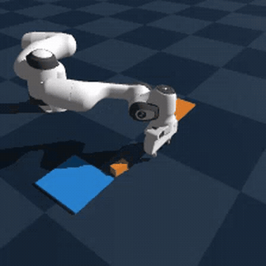
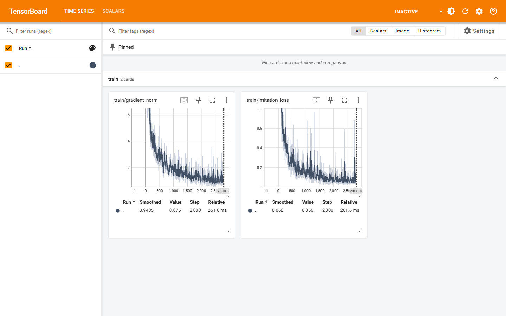

# Parcel Sorter ROCm

[](LICENSE)
[](https://rocm.docs.amd.com/)
[](https://github.com/Genesis-Embodied-AI/Genesis)

<a id="zh"></a>

中文：[项目简介](#overview) | [开发过程](#development) | [代码来源](#source) | [团队分工](#team) | [安装运行](#run) | [结果](docs/RESULTS.md)

<a id="en"></a>

English: [Overview](#overview) | [Development](#development) | [Sources](#source) | [Team](#team) | [Install](#run) | [Results](docs/RESULTS.md)



Parcel Sorter ROCm is a small, reproducible Genesis parcel-picking workcell for one AMD Radeon GPU with ROCm 7.2.1. It separates three things that are often conflated: a deterministic scripted reference controller, a bounded hybrid Agent+VLA action path, and a strict pure-VLA evaluation.

这是一个面向单张 AMD Radeon GPU 与 ROCm 7.2.1 的 Genesis 包裹抓取和分拣工位。项目刻意把三条路线拆开记录：确定性的脚本专家参考控制器、带执行约束的 Agent+VLA 路线，以及严格纯 VLA 闭环评测。

[本地成功视频](videos/genesis_panda_8_success_reference_demo.mp4) · [结果与科研图](docs/RESULTS.md) · [运行架构](docs/ARCHITECTURE.md) · [数据说明](data/README.md) · [提交材料](submission_materials/README.md)

<a id="overview"></a>

## 1. 项目简介 / Project Overview

任务是从随机初始布局中抓取一个包裹，越过 Panda 工作空间并放入指定格口。Genesis 负责物理与渲染；本仓库提供场景随机化、控制器、安全门、训练/评测记录，以及 AMD Radeon 的运行路径。核心不是把脚本结果包装成“模型成功”，而是检查学习动作在进入执行器前是否满足可执行约束。

The workcell receives RGB, robot state, and a task instruction. Controllers emit `CartesianAction`; Genesis executes it. The public demo is useful for inspecting the task, while the learned-policy records answer a narrower question about action validity.

### 结果归因 / Result Attribution

| 路线 / route | 已记录结果 / recorded result | 可以说明什么 / allowed interpretation |
| --- | ---: | --- |
| `ScriptedPickPlaceExpert + ClosedLoopSupervisor` | **8/10** 固定种子 episode | 脚本专家参考轨迹；视频中的控制器 |
| 原始 VLA，离线动作包络 | **0/42** | 原始学习动作在样本上越过至少一项执行边界 |
| Safety-clipped VLA / Harness-Lite，离线动作包络 | **42/42** | 动作包络合法，不是抓取或分拣成功率 |
| 严格纯 VLA 闭环 | **0/3** | 未完成任务，不能表述为成功 |

The 45.6-second MP4 directly concatenates eight successful scripted-expert overview streams. It is H.264 at 224x224 and 10 fps; it is not presented as native 1080p footage, a VLA result, or a real-robot run.

### 技术栈与目录 / Stack and Repository Map

| 目录或文件 / path | 用途 / purpose |
| --- | --- |
| `src/parcel_sorter/` | Genesis 环境、动作合约、脚本控制器、VLA 适配器与 Harness-Lite |
| `scripts/` | 演示、训练、评测、审计和 Radeon 环境脚本；首次运行看 `run_demo.sh` |
| `configs/` | 固定任务、控制和实验配置 |
| `tests/` | 入口、合约和结果格式的回归测试 |
| `evidence/training/` | 训练日志、运行摘要、离线消融 JSON 与 TensorBoard 导入事件 |
| `docs/assets/` | 由证据生成的训练/消融图与 README 预览素材 |
| `videos/` | 原始成功片段拼接、来源清单和复现拼接脚本 |
| `data/` | 提交 checkpoint 的数据状态与独立成功轨迹数据集说明 |

<a id="development"></a>

## 2. 开发过程 / Development Process

最早的问题不是 loss 不下降，而是原始 VLA 动作数值看起来接近专家动作，实际却会超出笛卡尔步长、力、IK 或工具指令边界。项目没有删除这些失败样本，而是把安全裁剪和 Harness-Lite 放在候选动作之后，并单独报告它们对离线动作合约的影响。

The Agent+VLA route is deliberately modest: a local SmolVLA or PI0.5 policy proposes actions or residuals; Harness-Lite checks Cartesian, force, IK, and tool limits before execution. In a residual configuration, the nominal motion remains scripted, so this route is hybrid rather than pure VLA.

```text
RGB + state + task -> PolicyContext -> VLA candidate -> Harness-Lite -> CartesianAction -> Genesis
                                      \-> scripted reference controller -> CartesianAction
```

`ActionPolicy.predict(context: PolicyContext) -> CartesianAction` is the common robot-side contract. The successful-video path is `ScriptedPickPlaceExpert + ClosedLoopSupervisor`; the strict pure-VLA route owns all declared task actions and recorded 0/3. Full interfaces and service boundaries are in [Architecture](docs/ARCHITECTURE.md).

GPT-5.6 Luna (`gpt-5.6-luna`) was used only as a development and orchestration Agent through Codex Runtime Responses-style tool calls: bounded implementation, evidence review, media checking, and release assembly. It does not receive live robot observations, call `ActionPolicy.predict`, or transmit robot actions.

### 训练与离线消融 / Training and Offline Ablation


单次 SmolVLA 训练在一张 Radeon GPU 上完成 2,800 updates；日志 loss 从 2.164 降至 0.056，平均吞吐为 6.33 updates/s，日志峰值显存为 2.32 GB。完整日志、运行摘要和可复现作图脚本都在 [训练证据](docs/TRAINING_EVIDENCE.md)。这证明优化运行过，不证明闭环任务完成。

The saved text log was imported after training into TensorBoard event files for inspection. This is an imported view, not an original training-time TensorBoard capture: [import manifest](evidence/training/tensorboard-import-v1/import_manifest.json) · [import script](docs/assets/import_training_log_to_tensorboard.py) · [full log](evidence/training/pash-primitive-smolvla-rocm-2800step-v1.log).



上图由保存的 2,800-step 文本日志在训练结束后导入 TensorBoard 生成，用于复核曲线，不是训练期间实时记录的截图。


| 方案 / treatment | 19-D control MAE | 动作包络 / action envelope | 解释 / interpretation |
| --- | ---: | ---: | --- |
| Raw VLA | 0.006563 | **0/42** | 未修改的学习动作 |
| Safety-clipped VLA | 0.005685 | **42/42** | 固定执行边界后的离线合法性 |
| Harness-Lite | 0.005266 | **42/42** | 有界缩放与安全检查后的离线合法性 |

42 个样本来自 7 个 episode 的 6 个阶段中间帧，彼此不独立；MAE 混合多个动作分量，没有统一物理单位。详细协议、延迟和限制见 [离线消融](docs/ABLATION_RESULTS.md)。

<a id="source"></a>

## 3. 代码来源说明 / Source Attribution

| 组件 / component | 上游来源 / upstream source | 本项目修改或原创部分 / project work |
| --- | --- | --- |
| Genesis 1.2.3 | [Genesis](https://github.com/Genesis-Embodied-AI/Genesis) | 包裹场景、传感器、Radeon 运行脚本、轨迹记录与测试 |
| LeRobot 0.6.1 | [Hugging Face LeRobot](https://github.com/huggingface/lerobot) | 本地 SmolVLA/PI0.5 适配、训练与动作合约 |
| Franka Panda MJCF | Genesis 发布的 Panda 资产 | 版本化包裹工具变体；上游网格和资产保持署名 |
| 本仓库 / this repository | `src/parcel_sorter/`, `scripts/`, `configs/` | 脚本控制器、任务逻辑、Harness-Lite、安全门、数据审计和交付工具 |

固定版本和许可证见 [UPSTREAM_LOCK.json](UPSTREAM_LOCK.json)、[第三方声明](THIRD_PARTY_NOTICES.md) 与 [MIT License](LICENSE)。没有把上游代码、资产或模型表述为本项目原创。

<a id="team"></a>

## 4. 团队分工 / Team Roles

`2658183739` 为唯一提交者，负责问题定义、系统方案、实验运行、证据复核、文档和最终发布。协作方式是把每项运行的配置、日志、摘要和哈希保留在仓库中，再以结果归因表审阅，不把不同控制器的数字混在一起。

The submitter used GPT-5.6 Luna/Codex Runtime as a bounded engineering and review tool. It is listed for development transparency, not as the robot controller or the source of the demonstrated trajectories.

<a id="run"></a>

## 5. 安装与运行 / Install and Run

记录环境为 Linux、单张 `gfx1100` Radeon GPU、ROCm 7.2.1、PyTorch 2.9.1 ROCm、Genesis 1.2.3、Python 3.12；学习策略路线额外使用 LeRobot 0.6.1。这里的 `cuda:0` 是 HIP 设备名。Docker 使用来自已完成 Radeon 运行环境的 `requirements-lock.txt` 约束依赖。

### Docker

```bash
docker build -f Dockerfile.rocm -t parcel-sorter-rocm .
docker run --rm --device=/dev/kfd --device=/dev/dri --group-add video \
  -v "$PWD/outputs:/workspace/parcel-sorter-rocm/outputs" parcel-sorter-rocm
```

### Native Radeon environment

```bash
source scripts/activate_radeon_env.sh
bash scripts/preflight_radeon.sh
bash scripts/run_demo.sh
```

`run_demo.sh` fixes episode 0, loads no checkpoint, records a scripted-expert video, and exits nonzero if the episode is unsuccessful. A successful run writes `outputs/scripted-demo/expert/summary.json` and `outputs/scripted-demo/expert/videos/episode_000000.mp4`; inspect the summary before treating the run as valid.

The submitted SmolVLA checkpoint records a different 7-episode, 4,557-frame training payload that is no longer locally available. The final delivery includes an independent successful-trajectory dataset (7 episodes, 6,454 frames, overhead plus left-wrist RGB-D); it must not be claimed as the checkpoint's training set. See [data status](data/README.md).
