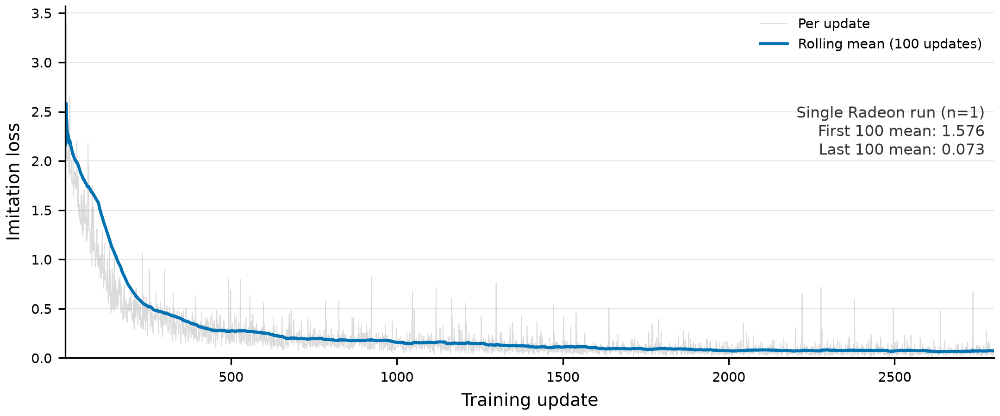

# Offline Ablation Results

Source: [`evidence/training/pash-primitive-smolvla-2800step-offline-ablation-v1.json`](../evidence/training/pash-primitive-smolvla-2800step-offline-ablation-v1.json). This is an offline action-contract ablation over 42 episode-stage samples from 7 episodes, not a closed-loop task-success evaluation.

| Treatment | Mean MAE | Mean MSE | Envelope passes |
| --- | ---: | ---: | ---: |
| Expert executor | 0.00447 | 0.000422 | 42/42 |
| Raw VLA | 0.00656 | 0.000972 | 0/42 |
| Safety-clipped VLA | 0.00569 | 0.000434 | 42/42 |
| Harness-Lite | 0.00527 | 0.000427 | 42/42 |

Harness-Lite recorded zero expert fallbacks, emergency stops, and tool-command corrections within this offline measurement. Its mean selected scale was 0.98214. These facts do not override the strict pure-VLA result: 0/3, not passed.

The corresponding PNG is copied from local evidence without alteration. TensorBoard export: **pending**.
