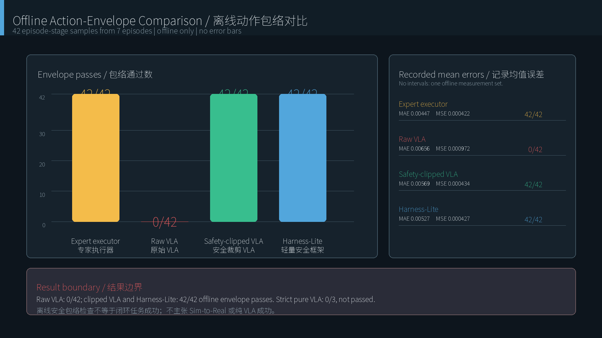

# Offline Ablation Results / 离线消融实验

Source / 数据源: [`pash-primitive-smolvla-2800step-offline-ablation-v1.json`](../evidence/training/pash-primitive-smolvla-2800step-offline-ablation-v1.json)

This is a frozen offline action-contract comparison over **42 episode-stage samples** selected as the middle frame of each of six stages in seven episodes. The policy queue was reset for each sample. These samples are correlated within episodes, so the table is descriptive and does not claim statistical significance or closed-loop task success.

这是在 **42 个 episode-stage 样本**上进行的冻结离线动作合约比较：从 7 个回合的 6 个阶段各取中间帧，每个样本前重置策略队列。同一回合内样本存在相关性，因此本表仅作描述，不宣称统计显著性，也不等同于闭环任务成功。

## Primary Comparison / 主要对比

| Treatment / 方案 | Mean MAE | Mean MSE | Action envelope / 动作边界 | What changed / 改动 |
| --- | ---: | ---: | ---: | --- |
| Expert executor / 专家执行器 | 0.004468 | 0.000422 | 42/42 | Reference executor / 参考执行器 |
| Raw VLA / 原始 VLA | 0.006563 | 0.000972 | **0/42** | Unmodified learned action / 未修改学习动作 |
| Safety-clipped VLA / 安全裁剪 VLA | 0.005685 | 0.000434 | **42/42** | Frozen execution limits / 固定执行边界 |
| Harness-Lite | 0.005266 | 0.000427 | **42/42** | Bounded scale and safety checks / 有界缩放与安全检查 |

## Supporting Measurements / 补充指标

| Metric / 指标 | Recorded value / 数值 | Interpretation / 含义 |
| --- | ---: | --- |
| Primitive-progress mean absolute error / 阶段进度平均绝对误差 | 0.115691 | Offline auxiliary prediction error / 离线辅助预测误差 |
| Warm mean inference latency / 预热后平均推理延迟 | 146.55 ms | Single recorded runtime / 单次已记录运行环境 |
| Warm p95 inference latency / 预热后 P95 延迟 | 147.47 ms | Descriptive only / 仅描述性指标 |
| Maximum recorded latency / 最大记录延迟 | 149.77 ms | Same offline run / 同一离线运行 |
| Harness-Lite mean selected scale / 平均动作缩放 | 0.98214 | Small average contraction / 平均收缩幅度较小 |
| Expert fallbacks / 专家回退 | 0 | Offline samples only / 仅指离线样本 |
| Emergency stops / 紧急停止 | 0 | Offline samples only / 仅指离线样本 |
| Tool-command corrections / 工具命令修正 | 0 | Offline samples only / 仅指离线样本 |

## What the Ablation Shows / 消融说明了什么

Raw learned actions violated at least one frozen execution limit for every selected sample. Applying the fixed safety envelope restored action validity for all 42 samples, and Harness-Lite slightly reduced mean action error relative to safety clipping alone. This supports the engineering choice to keep learned actions behind a supervisor.

原始学习动作在全部 42 个样本上都至少违反一项固定执行边界。加入固定安全包络后，42 个样本全部恢复动作合法性；Harness-Lite 相比单纯安全裁剪又略微降低平均动作误差。这支持“学习动作必须经过监督器”的工程选择。

## What It Does Not Show / 消融不能说明什么

- It is not 42 independent robot episodes. / 它不是 42 个相互独立的机器人回合。
- `42/42` means action-envelope validity, not pick-and-place completion. / `42/42` 表示动作边界合法，不表示抓放成功。
- It does not convert the strict pure-VLA result; pure VLA remains **0/3**. / 它不会改变严格纯 VLA 结果，纯 VLA 仍为 **0/3**。
- The successful video comes from `ScriptedPickPlaceExpert + ClosedLoopSupervisor`, not these learned-policy variants. / 成功视频来自 `ScriptedPickPlaceExpert + ClosedLoopSupervisor`，不是这些学习策略变体。
- No confidence interval is reported because the sample design does not provide independent repeats. / 由于样本设计不构成独立重复，不报告置信区间。

The next defensible experiment is a preregistered, paired closed-loop evaluation with independent randomized episodes and fixed failure handling. / 下一步应进行预先冻结协议的配对闭环评估，使用独立随机回合并固定失败处理规则。
