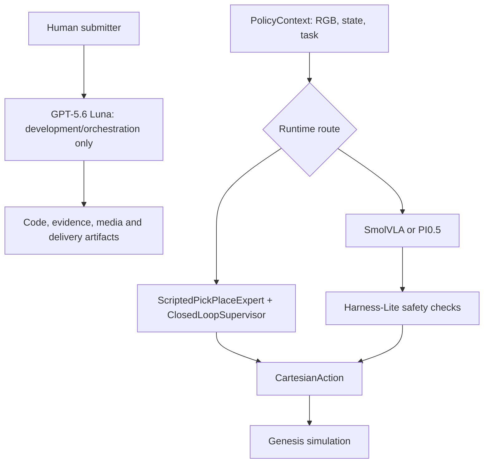

# Agent, Model, API and Architecture

## Development/Robot Boundary

**GPT-5.6 Luna is the development and orchestration Agent.** It assists
with bounded engineering, evidence review, media review and delivery work through
the Codex runtime's Responses-style filesystem, shell, Git and browser tools.
The model identifier used by the agent request is `gpt-5.6-luna`.
It is not a robot reasoning model: it does not receive robot observations, call
`ActionPolicy.predict`, or transmit robot actions. The same GPT-5.6 Luna boundary
applies to implementation, media and documentation work.

The successful simulation video is controlled by the deterministic runtime pair
`ScriptedPickPlaceExpert + ClosedLoopSupervisor`, not by GPT-5.6 Luna. That
controller reads privileged Genesis state and produced the reported 8/10
development screen. It is neither pure VLA nor real-robot evidence.

## Inventory

| Layer | Component | Interface | Result boundary |
| --- | --- | --- | --- |
| Development/orchestration | GPT-5.6 Luna | Codex Responses-style tool calls | Engineering and audit only; no robot control |
| Scripted robot control | `ScriptedPickPlaceExpert + ClosedLoopSupervisor` | `ActionPolicy.predict(PolicyContext) -> CartesianAction` | 8/10 deterministic expert/reference screen and demo video |
| Learned policy | Local SmolVLA | `LeRobotPolicyAdapter` | Offline action ablation |
| PI0.5 route | Local PEFT policy service | Authenticated Unix-domain socket | Strict pure-VLA campaign: 0/3, not passed |
| Hybrid VLA | Scripted nominal action plus learned residual and Harness-Lite | Bounded candidate selection | Offline action-envelope evidence only; not a successful video |

## Runtime Architecture



The successful video follows `PolicyContext -> ScriptedPickPlaceExpert +
ClosedLoopSupervisor -> CartesianAction -> Genesis`. The hybrid VLA route is
separately described because it may use a scripted nominal action and a learned
residual; it must never be labelled pure VLA. In the strict pure-VLA route the
learned policy owns all declared task actions; its recorded result is 0/3.

## APIs

Development requests select GPT-5.6 Luna, specify a bounded task, and expose
only required tools. Outputs are code changes, review notes, hashes, screenshots
or media artifacts. No model credential, API key or private endpoint is stored.

Robot controllers share this in-process boundary:

```python
class ActionPolicy(Protocol):
    def predict(self, context: PolicyContext) -> CartesianAction: ...
```

`PolicyContext` carries task instruction, state, supervisor decision and camera
observations. `CartesianAction` contains a bounded target pose and tool/task
commands. The development Agent API is never called from this robot loop.
