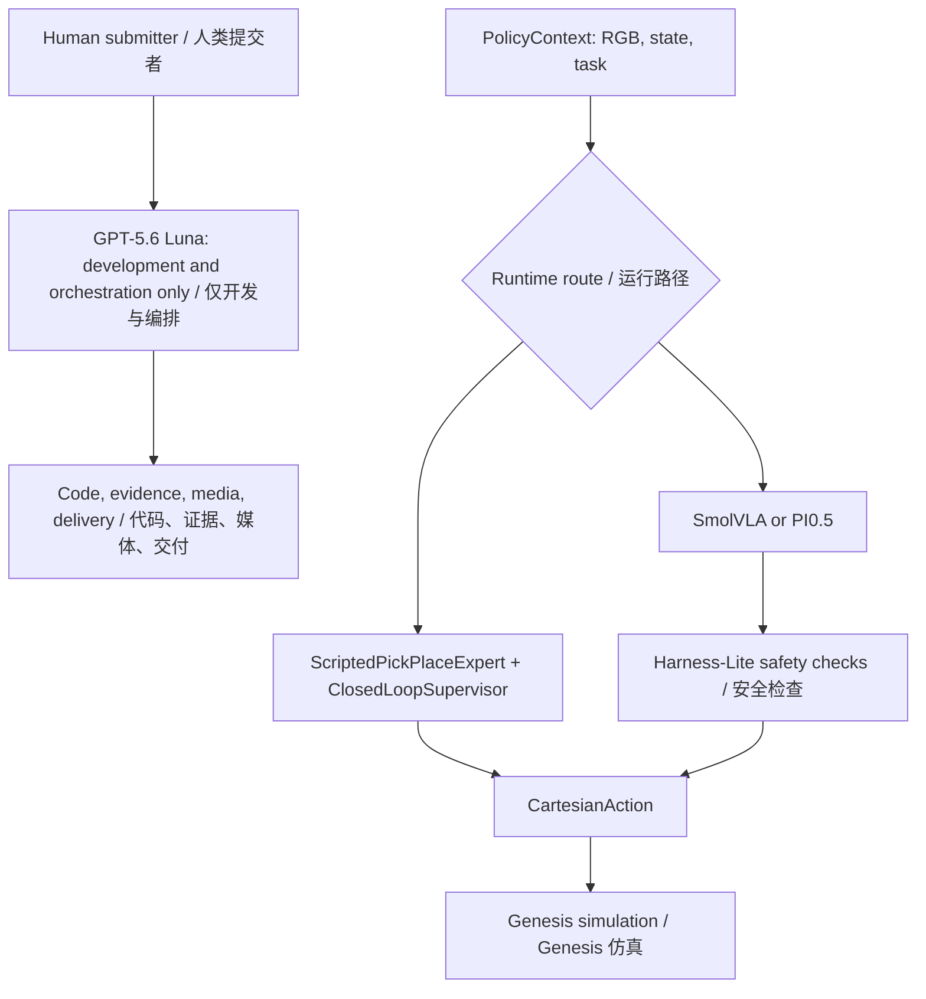

# Agent, Model, API and Architecture / Agent、模型、API 与架构

## Development/Robot Boundary / 开发与机器人边界

**GPT-5.6 Luna is the development and orchestration Agent.** The model ID is `gpt-5.6-luna`. It assists with bounded engineering, evidence review, media review and delivery work through the Codex Runtime's Responses-style tool calls for filesystem, shell, Git and browser operations. It is not a robot reasoning or control model: it does not receive live robot observations, call `ActionPolicy.predict`, or transmit robot actions.

**GPT-5.6 Luna 是开发与编排 Agent。** 模型 ID 为 `gpt-5.6-luna`。它通过 Codex Runtime 的 Responses 风格工具调用完成受限的工程开发、证据审阅、媒体检查和交付整理，所用工具包括文件系统、命令行、Git 与浏览器。它不是机器人推理或控制模型：不接收实时机器人观测，不调用 `ActionPolicy.predict`，也不发送机器人动作。

The successful simulation video is controlled by `ScriptedPickPlaceExpert + ClosedLoopSupervisor`. This deterministic controller reads privileged Genesis state and produced the reported **8/10** development screen. It is neither pure VLA nor real-robot evidence.

成功仿真视频由 `ScriptedPickPlaceExpert + ClosedLoopSupervisor` 控制。这个确定性控制器读取 Genesis 特权状态，得到报告中的 **8/10** 开发筛选结果；它既不是纯 VLA，也不是真机证据。

## Inventory / 组件清单

| Layer / 层 | Component / 组件 | Interface / 接口 | Result boundary / 结果边界 |
| --- | --- | --- | --- |
| Development/orchestration / 开发与编排 | GPT-5.6 Luna (`gpt-5.6-luna`) | Codex Runtime Responses-style tool calls / Responses 风格工具调用 | Engineering and audit only; no robot control / 仅工程与审计，不控制机器人 |
| Scripted robot control / 脚本机器人控制 | `ScriptedPickPlaceExpert + ClosedLoopSupervisor` | `ActionPolicy.predict(PolicyContext) -> CartesianAction` | 8/10 reference screen and demo / 8/10 参考筛选与演示视频 |
| Learned policy / 学习策略 | Local SmolVLA / 本地 SmolVLA | `LeRobotPolicyAdapter` | Offline action ablation / 离线动作消融 |
| PI0.5 route / PI0.5 路径 | Local PEFT policy service / 本地 PEFT 策略服务 | Authenticated Unix-domain socket / 鉴权 Unix 域套接字 | Strict pure-VLA campaign: 0/3 / 严格纯 VLA：0/3 |
| Hybrid VLA / 混合 VLA | Scripted nominal action + learned residual + Harness-Lite / 脚本名义动作 + 学习残差 + Harness-Lite | Bounded candidate selection / 有界候选选择 | Offline 42/42 action-envelope evidence only / 仅离线 42/42 动作包络证据 |

## Runtime Architecture / 运行架构



The successful video follows `PolicyContext -> ScriptedPickPlaceExpert + ClosedLoopSupervisor -> CartesianAction -> Genesis`. The hybrid route may combine a scripted nominal action with a learned residual, so it must not be labelled pure VLA. In the strict pure-VLA route, the learned policy owns every declared task action; the recorded result is **0/3**.

成功视频走的是 `PolicyContext -> ScriptedPickPlaceExpert + ClosedLoopSupervisor -> CartesianAction -> Genesis`。混合路径可把脚本名义动作与学习残差组合，因此不能标成纯 VLA。严格纯 VLA 路径中，学习策略独立负责所有声明的任务动作，实测结果为 **0/3**。

## APIs / 接口

Development requests select GPT-5.6 Luna, define a bounded task and expose only required tools. Outputs are code changes, review notes, hashes, screenshots or media artifacts. No model credential, API key or private endpoint is stored in the repository.

开发请求选择 GPT-5.6 Luna，限定任务范围，并只开放所需工具。输出是代码改动、审阅记录、哈希、截图或媒体文件。仓库不保存模型凭证、API Key 或私有端点。

Robot controllers share this in-process contract / 机器人控制器共享如下进程内合约：

```python
class ActionPolicy(Protocol):
    def predict(self, context: PolicyContext) -> CartesianAction: ...
```

`PolicyContext` carries the task instruction, state, supervisor decision and camera observations. `CartesianAction` contains a bounded target pose and tool/task commands. The development Agent API is never called from this robot loop.

`PolicyContext` 包含任务指令、状态、监督器决策和相机观测；`CartesianAction` 包含有界目标位姿与工具/任务命令。机器人运行闭环不会调用开发 Agent API。

## Evidence Boundary / 证据边界

| Claim / 结论 | Evidence / 证据 | Allowed wording / 可用表述 |
| --- | --- | --- |
| GPT-5.6 Luna usage / Luna 使用 | Delivery and engineering workflow / 交付与工程流程 | Development/orchestration Agent / 开发与编排 Agent |
| Scripted controller / 脚本控制器 | 8/10 trajectories and 59 s video / 8/10 轨迹与 59 秒视频 | Scripted-controller success / 脚本控制器成功 |
| Hybrid controller+VLA / 混合控制器+VLA | 42/42 offline envelope checks / 42/42 离线包络检查 | Offline action validity only / 仅离线动作合法性 |
| Pure VLA | 0/3 strict closed-loop trials / 0/3 严格闭环试验 | Failed, not passed / 失败，未通过 |
