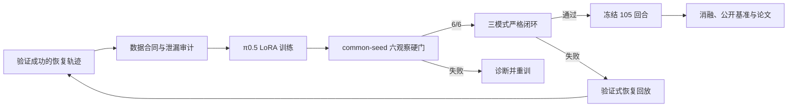

# π0.5 VLA 微调、闭环评测与论文复现指南

更新日期：2026-07-28

## 目标与证据层级

本项目的目标不是让确定性抓取器达到高分后再给结果贴上 VLA 标签，而是让 π0.5 自主完成抓取模式选择、接触点残差预测、任务进度判断和闭环动作修正。Harness 只负责表面法向姿态、IK、碰撞、力限、有界保持和防误释放。确定性专家可以生成训练示范，但其成功率不能计入 π0.5 成功率。

实验必须按四层证据逐级晋级。第一层是训练数值稳定，只证明 ROCm、数据和梯度链路可运行。第二层是模式隐藏的离线 checkpoint 筛选，只证明模型在固定观察上能输出正确模式和非零残差。第三层是真实 π0.5 严格闭环，要求抓取、抬升、运输、放置和释放全部由同一 checkpoint 驱动且专家回退为零。第四层是冻结确认评测，才允许报告总体成功率和统计区间。任何较低层结果都不能替代较高层结果。



## 数据如何形成

一次失败首先保存 RGB-D、机器人状态、π0.5 原始输出、Harness 投影、逐杯密封、力历史、失败阶段和失败原因。失败动作本身不作为正确示范。恢复生成器可以退回、平移接触点或在后续尝试切换模式，但只有完整完成抓取、运输、指定位置放置和释放，并且没有超过力限制的轨迹，才能转换为接触残差监督。

数据转换把成功执行的接触目标减去名义锚点，得到左右接触点的 `Δx/Δy/Δz`。14 维动作还包含底盘残差、三个模式 logits、吸盘意图和 primitive 进度。训练、开发筛选与冻结评测的 episode ID 必须互斥；重复播放同一条轨迹只能改变训练采样权重，不能增加独立示范数量。

正式训练前运行数据审计。审计至少验证 80 维状态与 14 维动作形状、全阶段模式输入隐藏、三模式均有覆盖、非零残差数量、接触锚点重建、进度范围、分位归一化宽度以及源数据哈希未被派生数据修改。当前 R9 数据包含 5,871 帧，模式标签在分位归一化前后的 argmax 错配为 0，模式状态泄漏为 0。

```bash
PYTHONPATH=src python scripts/audit_mobile_pi05_residual_dataset.py \
  --dataset-root DATASET_ROOT \
  --output outputs/dataset-audit.json

PYTHONPATH=src python scripts/diagnose_mobile_pi05_mode_dataset.py \
  DATASET_ROOT \
  --output outputs/mode-diagnostic.json
```

## 当前输入与动作合同

当前 R9 的 π0.5 主干实际消费顶部 RGB-D和模式盲语言。语言由可观测形状、尺寸、估计质量、任务阶段和重试次数构成，不出现三种模式名称。虽然 batch 中存在 80 维 `observation.state`，LeRobot 0.6.1 的 π0.5 前向路径没有读取它，因此不能声称 R9 已经使用逐杯密封或力历史。

计划中的 E4 会把归一化状态零填充到 96 维，经可训练投影变成一个 PaliGemma 前缀 token。该 token 会强制清零三个模式 one-hot 和六个模式依赖名义接触锚点，只允许机器人状态、密封、几何质量、阶段、重试和力历史进入。锚点由专家模式几何产生，而正式路由先于模式专用 IK，暴露锚点会形成标签捷径。投影层必须完整保存和重载，并通过状态敏感性、泄漏和保存一致性测试后才能参加闭环消融。

π0.5 输出为 14 维受约束残差。pregrasp、grasp approach、lift 和 transport 的机械臂残差上限分别为 20、10、5 和 10 mm。模型输出决定 top suction、side suction 或 cooperative cradle；Harness 不能用隐藏标签改写这一决定。姿态、IK、碰撞、35 N 力限和释放互锁仍由确定性安全层负责。

## LoRA 训练

正式候选固定使用同一 π0.5 base revision、LoRA rank 16、alpha 32、冻结视觉编码器、bfloat16 AMP 和 seed 11。R8 的 3,000 步约为 0.51 epoch，只学到部分纯噪声模式分类。R9 从 base 重新训练 12,000 步，模式维度 MSE 权重为 4，`t=1` 模式交叉熵权重为 2，每 3,000 步保存一次。

```bash
MOBILE_PI05_MODE_LOSS_WEIGHT=4 \
MOBILE_PI05_MODE_CE_WEIGHT=2 \
MOBILE_PI05_MODE_CE_TIME=1 \
MOBILE_PI05_SAVE_FREQ=3000 \
bash scripts/launch_mobile_pi05_training_rocm.sh \
  DATASET_ROOT RUN_ROOT TRAIN_LOG 12000
```

训练日志中的总 loss、flow loss、模式交叉熵、模式准确率、模式 margin、梯度范数和学习率由 `summarize_mobile_pi05_training.py` 解析。训练准确率即使达到 1.0，也只说明训练 batch 拟合，不能证明新观察或完整扩散采样正确。

## Checkpoint 硬门

每个 checkpoint 使用两个 top、两个 side 和两个 cradle 观察。三个模式真值只用于离线评分，不进入模型输入。所有观察复用 `[20260727, 20260728, 20260729]` seed panel，即 common random numbers，避免把物体差异与扩散噪声顺序混杂。汇总器会拒绝 seed panel 不一致、模式输入未隐藏、样本不足、非有限输出、零残差、专家回退或非 π0.5 policy。

```bash
bash scripts/screen_mobile_pi05_checkpoints_rocm.sh \
  RUN_ROOT DATASET_ROOT SCREEN_OUTPUT RUN_NAME \
  3000 6000 9000 12000
```

完整扩散必须达到 6/6 才能进入闭环。`probe_mobile_pi05_high_noise_mode_rocm.py` 的 `t=1` 结果只是机制诊断：它可以区分辅助模式目标没有学会，还是多步扩散破坏了已经学到的离散信息，但不能作为抓取成功率。若 `t=1` 达到 6/6 而完整扩散失败，下一候选可比较由 π0.5 `t=1` 输出模式、由同一 π0.5 完整扩散输出连续残差的混合离散连续解码；禁止换成规则分类器。

## 严格闭环与恢复

通过离线硬门后，先在开发配置上分别运行 top、side 和 cradle 严格闭环。抓取模式必须由 π0.5 在模式专用 IK 生成之前选出，且执行分支必须与模型选择一致。每个关键阶段都要查询 π0.5，专家回退必须为零，接触残差必须真实进入执行目标。Harness 拒绝危险动作是安全行为，但发生拒绝的 episode 不能被记为成功。

一次接触失败最多恢复三次。第一次使用 π0.5 的首选接触点，第二次根据密封失败方向退回并平移，第三次允许 π0.5 重新选择模式。恢复轨迹只有在完成全任务并通过力限后才进入下一轮数据；失败状态和原因可以保留用于采样，但失败动作不能伪造成正标签。模型只在 rollout 之间离线更新，不能在同一回合中改变权重。

## 冻结评测与统计

冻结集合包含 105 个独立 episode，由 21 个快递 profile 和每类 5 个预注册扰动组成。视频帧、控制步、三次模式投票和回合内重试都属于重复测量，不能扩大样本量。主指标是完整 VLA pick-transport-place-release 成功，次指标包括稳定密封率、阶段失败率、位置误差、最大接触力、安全拒绝率、非零残差频率、推理延迟和专家回退数。

工程晋级要求至少 95/105、专家回退 0、VLA 合格回合 105/105，且安全违规不增加。95/105 的 Wilson 95% 下界只有约 83.35%，因此不能声明总体成功概率超过 90%。在单侧精确二项检验 `H0: p <= 0.90`、`alpha=0.05` 下，105 回合至少需要 100 次成功才能作该声明。候选间使用完全相同的 episode 顺序，并用 exact McNemar 检验配对差异。

## 消融、自进化和论文

核心消融从 E1 的 RGB π0.5 种子开始，依次加入模式均衡、验证成功的非零接触残差、RGB-D与原生状态 token、验证式失败回放。确定性 Harness 作为 E0 物理参考线单独报告，不能进入 VLA 成绩。补充消融包括关闭接触残差、关闭力历史、关闭第三次模式切换、打乱 π0.5 输出和关闭三样本模式共识。

Workshop 稿采用 IROS 双盲模板，写成完整 IMRAD 叙事。方法段描述合同、纯噪声模式监督和验证式自进化；结果段只读取机器生成的 screen、closed-loop summary 和冻结 audit；讨论段明确区分数值稳定、离线模式判断和闭环能力。R8 的失败应作为机制负结果保留，而不是从结果中删除。摘要和结论必须最后填写，在冻结结果达到统计门之前不能出现“成功概率超过 90%”。

公开基准在内部快递冻结评测达到至少 95/105 后启动。BridgeData V2 用于样本效率，DROID 用于场景泛化，Open X-Embodiment 用于跨本体迁移，LIBERO/CALVIN 用于交互式语言任务。离线动作误差不能写成闭环成功，公共 benchmark adapter 也不能与快递机器人 adapter 混为同一模型。

## 复现实验时应先看什么

实验事实以 `docs/PI05_VLA_EXPERIMENT_LOG_CN.md` 为准，预注册统计与投稿边界以 `docs/PI05_VLA_RESEARCH_PROTOCOL_CN.md` 为准，公开基准范围以 `docs/PI05_PUBLIC_BENCHMARK_PLAN_CN.md` 为准。数据和模型结果必须追溯到 `evidence/pi05_vla/` 下的 JSON、远端训练日志、checkpoint hash 和冻结 episode manifest。论文中的数字不能手工覆盖机器生成工件。
