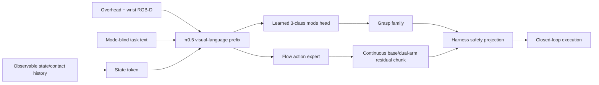

# π0.5 VLA 微调与架构经验综述

更新日期：2026-07-28。本文将官方实现、论文结果和社区复现经验分开标注。项目内所有成功率均指真实 π0.5 闭环策略结果；确定性专家、几何路由器和 Harness 安全控制不计入 VLA 成绩。

## 1. 结论

现阶段不应更换 π0.5，也不应仅在 R9 上继续增加训练步数。公开证据与项目诊断共同指向四个优先项：首先固定归一化和动作语义契约；其次将离散抓取模式与连续 flow residual 解码分开；再次补入 π0.5 当前 LeRobot 实现实际忽略的本体/接触状态；最后才比较更长训练、LoRA rank 和更充分的 action expert 更新。当前 R8 在相同随机种子下表现为完整 flow 采样 `2/6`、纯噪声端点 `t=1` 诊断 `4/6`，正是“连续扩散过程破坏离散路由”的直接项目证据。

官方 OpenPI 的 π0.5-LIBERO 配方是 30,000 步、batch size 256 的全量微调，公开检查点平均成功率为 96.85%。这说明 20k–30k 量级是合理的检查点区间，但不能据此推断单卡 batch 1、LoRA rank 16 的 12k 步等价。OpenPI 的 DROID 训练说明还明确报告其 LoRA 尝试尚未获得良好策略。与此相对，OpenVLA-OFT 在 OpenVLA 架构上使用 rank 32、连续动作头、动作分块、腕部图像和本体状态取得 97.1% LIBERO 平均成功率。因此，本项目应把 LoRA rank 16 看作资源受限筛选条件，并设置 rank 32 和“VLM LoRA + action expert 充分更新”对照，而不是提前宣称 LoRA 足够。

## 2. 证据分层

| 证据 | 等级 | 可复现事实 | 对本项目的含义 |
|---|---:|---|---|
| OpenPI README、训练配置、LIBERO 示例 | A：官方实现 | π0.5 基座含 10k+ 小时机器人预训练；LIBERO 配方 30k 步、horizon 10；官方结果 96.85% | R9 的 12k 步是筛选，不是最终收敛依据 |
| OpenPI normalization 文档与 issue #971 | A：官方实现/回归证据 | 状态和动作的归一化/反归一化必须一致；z-score 被误切到 quantile 可使官方检查点接近 0% | 训练前和加载时必须校验统计哈希与归一化类型 |
| OpenPI DROID 训练说明 | A：官方实现经验 | 动作空间需明确；idle chunk 过滤能改善表现；全量训练约 100k 步、batch 256；其 LoRA 尝试表现不佳 | 不把 rank 16 LoRA 当作最终上限；过滤近零无效 chunk |
| LeRobot π0.5 源码 | A：直接代码审计 | `PI05Policy.forward()` 与 `predict_action_chunk()` 未使用 `observation.state`，而 π0 路径有 `state_proj` | R6–R9 的数值状态只经语言桥间接暴露；E4 需要原生状态 token |
| LeRobot π0.5 文档与源码 | A：官方实现 | 当前文档支持 relative action stats；源码默认 chunk 50、quantile normalization，但仍明确跳过独立 state 输入；另提供 flow policy 的 RTC 接口 | 本项目的 14-D residual 保持相对动作语义；state token、chunk 执行和 RTC 必须分别消融 |
| π0/π0.5/FAST 论文与官方项目页 | B：论文/作者材料 | π0 用 flow matching 生成高频连续动作；π0.5 强调异构数据共训练和高低层联合；FAST 用 DCT+BPE 压缩 action chunk | 保留 π0.5 连续 flow residual；不把模式强塞进连续轨迹 |
| OpenVLA-OFT 论文、项目页和代码 | B：论文/官方代码 | 并行解码、action chunk、连续动作、L1 头提升速度与成功率；腕部图像和 proprio 是显式输入 | 采用“离散模式头 + 连续 residual flow”的混合解码，并补近景和状态 |
| Octo 官方代码与论文 | B：论文/官方代码 | 多 RGB 输入、模块化注意力、diffusion action head 可适配新传感器和形态 | 模态扩展要保持模块化并做输入消融 |
| OpenVLA troubleshooting | B：官方项目经验 | 先回放数据动作，再离线复现训练误差；避免 idle、小动作和策略多模态；覆盖评测变化 | 建立数据回放、离线一致性和无效 chunk 门禁 |
| RIPT-VLA、SimpleVLA-RL | C：近期预印本/开源实现 | 稀疏成败奖励、K-rollout、动态采样可在 LIBERO 改善 VLA；证据主要来自仿真 | 仅在稳定 SFT 基线后作为 E6；物理系统先使用验证式恢复回放 |
| OpenPI issue #672 等社区讨论 | D：社区经验 | delta/absolute 误配、action dimension 和 LoRA 配方经常出错 | 仅用来发现风险，不作为结论或性能依据 |

## 3. 动作与归一化契约

动作语义错误比优化器选择更容易造成灾难性失败。OpenPI 要求在训练前计算 normalization statistics，并建议仅在机器人和动作定义与预训练完全一致时复用预训练统计；否则应同时比较目标数据新统计。OpenPI issue #971 给出了强反例：官方 π0-FAST-LIBERO 检查点因训练时 z-score 与推理时 quantile 不一致，出现机械臂旋转和近 0% 成功率，修复后固定输入的状态、token 和 action chunk 才恢复逐位一致。OpenPI 还将 action dimension mismatch 和稀有维度的极小 `q01`、`q99`、`std` 列为主要故障源。

本项目已经实现 `PI05_TRAINING_CONTRACT.json`。该文件记录 30 Hz 数据频率、30 步 action chunk、计划执行窗口 10 步、80 维可观测状态、14 维受限专家相对笛卡尔残差、quantile 统计哈希、数据清单哈希、基座版本、绝对/增量定义以及状态 token/模式头协议版本。使用状态 token 或模式头的检查点若缺少契约、指纹被修改、维数、chunk 或架构协议不一致，将在静态审计或控制器加载阶段失败。实际 R9 数据的契约烟测指纹为 `ac16f4696cbee9ba2cdff69dde9f4acfc00291d5b178a91c44875ab562ab0493`。

OpenVLA 的 5–10 Hz 建议不能直接照搬。该建议针对没有 action chunk 的自回归 OpenVLA；π0/π0.5 原生面向高频连续 action chunk。项目应保留 30 Hz 原始频率，同时消融 `chunk_size/n_action_steps = 30/10、20/5、10/3`，比较闭环延迟、接触超调和成功率。任何设置都必须先通过演示动作回放，证明降采样后任务仍可完成。

代码审计发现当前低频控制器此前把 `config.n_action_steps` 强制设为 1，每次推理只取 chunk 第一个动作，并在 3 Hz 推理间隔内保持该动作；训练契约中的 10 步执行窗口尚未真实落地。现已增加 opt-in 的 `pi05-window-aggregate-v1`：对下一个执行窗口内的连续 residual 和 mode logits 取均值，吸盘意图与任务进度取窗口末端值。默认仍为 `first-action-hold-v1`，因此不会改变 R9/R10 既有筛选。该聚合只能作为低频执行近似，正式高分候选还要比较 30 Hz 分块执行以及 LeRobot RTC。RTC 必须报告实际推理延迟和 chunk 边界连续性，不能把同步重采样冒充实时异步执行。

## 4. 混合 VLA 解码架构

项目采用同一个 π0.5 VLA 内部的混合解码，而不是确定性几何分类器。顶部 RGB-D、腕部 RGB-D、语言任务和可观测状态进入 π0.5。新增的 fused mode head 对经过 PaliGemma 主干上下文化的视觉-语言前缀特征做有效位池化，并输出 `top_suction`、`side_suction`、`cooperative_cradle` 三类 logits；原生 action expert 继续通过 flow matching 输出底盘和双臂接触点连续残差、吸盘意图和进度。训练时模式头复用 π0.5 原本的视觉语言联合前向，不从原始 embedding 旁路分类。Harness 只进行单位变换、IK、碰撞/力限制、残差边界、承托保持和释放互锁，不提供模式标签或专家动作回退。

该设计与 OpenVLA-OFT 的“连续 action head + proprio + 多视角”经验一致，但保留了 π0.5 的 flow action expert。它也直接针对 R8 的诊断：离散模式不再依赖完整 flow 从纯噪声积分到动作端点，因此模式分类误差不会随扩散步累积。为避免标签泄漏，状态 token 永久清零模式 one-hot `52:55` 和由模式决定的接触 anchor `74:80`；pregrasp 语言中不出现模式词。模式头与 `state_proj` 都作为 PEFT `modules_to_save` 完整保存，不能依赖随机基座重建。

## 5. 训练路线

R9 保持原配置完成：π0.5 base、LoRA rank 16/alpha 32、冻结视觉编码器、mode flow MSE 权重 4、`t=1` CE 权重 2、12k 步。每个 3k 检查点在相同六个观测和相同三组种子上进行完整 flow 与 `t=1` 诊断。只有完整 VLA 路由达到 `6/6` 才允许进入三条开发闭环；训练 loss 或 batch mode accuracy 不能替代这一门槛。

若 R9 未通过，R10 不从 R9 继续堆步数，而是从固定 π0.5 base 训练 fused mode head。第一阶段使用 overhead RGB-D 和 mode-blind language，对比 flow-channel mode 与 fused head；第二阶段加入状态 token；第三阶段加入腕部 RGB-D。R10 的逐帧模式分布为 43.81%/36.23%/19.96%，因此模式头采用由训练 parquet 固定计算的 `N/(3 n_c)` 类别权重，并在契约中记录；后续保留 unweighted head 对照。LoRA 先比较 rank 16 与 rank 32。若 rank 32 仍受限，则进行单独显存烟测，比较 VLM LoRA 加 action expert 更充分更新的混合策略。官方 OpenPI PyTorch 路径目前不支持 LoRA，而本项目使用 LeRobot PEFT，因此每一种配置都必须做真实基座加载、adapter 保存/重载、`safetensors` 模块存在性和固定输入输出一致性验证。

训练停止应基于冻结筛选与验证曲线，而不是训练 loss 单独决定。建议检查点为 3k、6k、9k、12k、20k 和 30k；同一配置不得根据冻结 105 回合反复调参。冻结集只用于候选晋级，开发参数由独立开发三回合和训练/验证集完成。这样避免把 105 回合逐步过拟合成开发集。

OpenPI DROID 的 idle 过滤经验不能机械套到本项目。14-D residual 中零接触残差可能是正确安全标签，而固定模式 logits 又会让所有 chunk 看似“非零”。因此新增数据审计只用底盘/双臂 residual `0:9`、吸盘转变和 progress 跨度识别 largely-idle chunk。真实 R10 数据审计为 5,871 个 chunk 中 5,861 个 informative、仅 10 个 largely idle，即 `0.17%`；idle 过滤不是当前瓶颈，取消专门 filter/no-filter 训练消融，保留指标作为数据漂移门禁即可。成功恢复轨迹不得因零 residual 被清掉。

## 6. 自进化学习

安全的自进化不是把失败动作直接回灌。每次失败保存观测、π0.5 action chunk、模式 logits、吸盘密封、接触力历史、Harness 拒绝原因和阶段；随后由同一个 VLA 在受限残差空间进行最多三次恢复。只有最终完成放置、力约束合格且无专家回退的恢复轨迹，才作为新的正动作轨迹进入训练池。纯失败轨迹只用于失败原因分类、困难状态采样和可选的稀疏结果优化，不作为行为克隆标签。

该协议可视为受安全约束的 dataset aggregation：它继承 DAgger 对部署分布状态再采样的思想，但用“验证成功的自主恢复”替代未经验证的专家标签。模型达到稳定 SFT 基线后，再设置 RIPT 风格的 E6：每个困难初态做 K 次 VLA rollout，使用二元任务成功和安全违规惩罚，采用组内基线/leave-one-out advantage 更新 LoRA，且保留旧成功轨迹回放以限制遗忘。RIPT-VLA 的 LIBERO 结果支持这种方向，但它仍是近期仿真证据，因此不能在本项目中先于稳定 SFT 闭环使用，也不能把仿真提升直接外推到物理成功率。

## 7. 消融设计

消融以初始物体类型为区组，以冻结 episode seed 为独立试验单位，并在各方法间使用 common random numbers。训练 seed 至少三个；同一物理 episode 内的多个控制帧不是独立样本。主要响应变量是完整抓取并放置成功率，次要响应包括模式准确率、双/单吸盘密封率、首次接触成功率、三次恢复成功率、最大接触力、Harness 拒绝率、动作延迟和无专家回退率。

| 实验 | 唯一新增因素 | 目的 | 晋级门槛 |
|---|---|---|---|
| E0 | 确定性系统，仅作基础设施参照 | 衡量环境和机械执行上限 | 不计入 VLA 成绩 |
| E1 | π0.5 RGB-D residual，flow channel 兼任模式 | 真实 VLA 基线 | 6/6 路由后才闭环 |
| E2 | E1 + `t=1` mode CE | 检验高噪声监督 | 与 E1 同种子比较 |
| E3 | E1 + fused visual-language mode head | 分离离散/连续解码 | 6/6，且模式无标签泄漏 |
| E4 | E3 + mode-blind observable state token | 检验接触/本体状态价值 | 成功率提高且力违规不增 |
| E5 | E4 + wrist RGB-D | 检验最后 2–5 cm 近景精度 | 首次密封率和放置率提高 |
| E5a | E5 + 10-step 窗口平均 | 检验低频聚合是否优于首动作保持 | 接触超调下降且安全不退化 |
| E5b | E5 + 30 Hz 顺序 chunk 执行 | 检验 action chunk 的时序结构是否有价值 | 边界跳变下降且首次密封率提高 |
| E5c | E5b + RTC | 检验异步重规划是否降低推理等待 | 实际延迟下降且安全不退化 |
| E6 | E5c + 验证式恢复回放；可选 sparse-outcome post-training | 检验自进化 | 独立冻结集提高，旧任务不退化 |

工程目标 `>90%` 要求至少 `95/105`，但论文中声称真实成功概率大于 0.90 需要更强证据。预注册规则要求至少 `100/105`，并报告单侧 exact binomial 下置信界，而不是仅报告点估计。接触力违规、专家回退和模式泄漏是并列否决项；成功率提高不能抵消安全恶化。

## 8. 公共基准

内部真实 VLA 未达到 `95/105` 前不启动公共基准，以免分散调试。达到门槛后优先运行 LIBERO Spatial/Object/Goal/Long，因为 OpenPI π0.5 和 OpenVLA-OFT 都有可比结果。第二基准使用 RoboTwin 2.0，检验双臂和空间泛化。DROID/BridgeData V2 更适合作为跨机器人预训练或离线适配数据，不能直接与本项目 14 维残差混合；必须使用独立 action adapter、独立 normalization statistics 和单独报告。真实 DROID 泛化可进一步提交 RoboArena，但属于后续物理验证。

## 9. 当前实施状态

R8 的完整扩散路由为 `2/6`，`t=1` 诊断为 `4/6`，因此未进入闭环。R9 已完成 `12,000/12,000` 步；3k、6k、9k、12k 四个 checkpoint 的 `t=1` 诊断均为 `4/6`，完整 flow 筛选均为 `3/6`，没有 checkpoint 达到 `6/6`，因此 R9 同样未进入闭环。完整 flow 初次工件还揭示共同随机数实现错误：probe 只重置通用调用计数，而实际扩散种子取自独立推理计数，导致六个观测依次消耗 18 个不同 seed。现已新增公开运行时重置接口，同时清空推理计数、动作队列、上一动作和力历史；本地与 Radeon 定向回归均为 `27 passed`。R9 的 `3/6` 模式错误本身仍成立，但带 `sampling_seed_panel_mismatch` 的旧工件只保留为故障证据，不作为正式共同随机数结果；R10 起必须使用真正相同的 `[20260727, 20260728, 20260729]` 面板。contextualized fused mode head、state token、PEFT 完整保存配置、训练/推理契约指纹和控制器严格加载已实现为 opt-in。六观察索引来自训练数据本身，现已在 probe 和汇总工件中明确标为 `training_distribution_development`；它只能决定是否值得进入三条开发闭环，不能证明未见物体泛化。

新增 `smoke_mobile_pi05_augmented_peft_rocm.py` 作为增强架构的真实基座门禁。该脚本使用 LeRobot 正式 `wrap_with_peft()` 路径同时注册 `state_proj` 和 `mode_head`，保存 adapter 与带架构版本的运行时契约，再从磁盘重建基座和 PEFT；固定图像、状态、语言 token、扩散噪声和采样步数后，逐项比较 state embedding、contextualized mode logits 和 action chunk。脚本已通过本地/远端语法检查，配套回归为 `15 passed`；完整 GPU round-trip 必须等 R9 释放显存后执行。该门只证明架构保存/加载等价，不代表路由或闭环能力。当前没有任何证据支持“已达到 90%”，冻结 105 回合仍未开放。

R11 后新增严格顺序的 R12 rank 消融门。只有 R11 的四个 3k/6k/9k/12k checkpoint 均未达到完整 flow `6/6` 时，才先执行 rank 32 的真实基座保存/重载、峰值 ROCm 推理显存记录和静态契约审计，然后从同一 base 重新训练 R12。R12 相对 R11 只修改 LoRA rank `16→32`，alpha 仍为 32；数据、seed、12k 步、类别权重、mode head、state token 与执行协议均不变。若 R11 已通过离线路由门，则 R12 不启动，先进行严格开发闭环，避免用额外超参数搜索替代真实控制验证。

运行时新增 `pi05-open-loop-queue-v1`，但不改变 R9–R12 的默认首动作保持协议。该路径一次推理取得有序 residual chunk，随后在 30 Hz 控制帧逐项消费；每一项都使用当帧专家参考重新投影为受限绝对动作，并重新执行 Harness 力、深度和目标方向门。阶段变化、抓取模式投票或显式重新规划会清空旧 chunk，避免把 pregrasp 动作带入 grasp/lift。遥测分别记录推理次数、控制动作次数、chunk 索引、剩余步数和连续 residual 的边界 L2，因此可以把“推理更少”和“动作更平滑”分别验证。窗口平均、顺序执行和 RTC 被拆为三个独立消融，不能合并报告。

## 10. 2026-07-28 复核后的直接决策

本轮通过 arXiv API 一次定向查询 `2504.16054,2502.19645,2506.07339,2505.17016`，并直接读取 OpenPI 与 OpenVLA-OFT 官方主分支。π0.5 论文支持异构数据协同训练和高低层语义/动作联合建模，但没有给出本项目这种单卡 LeRobot-LoRA 配方的实体成功率保证。OpenPI 的 π0.5-LIBERO 配置仍是全量微调、`batch_size=256`、`30,000` 步；DROID 全量配方是 `100,000` 步、`batch_size=256`，其官方训练说明明确写明尚未得到表现良好的 LoRA 策略。OpenPI 当前 PyTorch 路径也明确列出 LoRA 尚不受支持，因此 OpenPI 高分 checkpoint 与本项目 LeRobot PEFT 不能视为同一训练实现。

OpenVLA-OFT 的可迁移经验是结构因素而不是模型替换：`LoRA rank=32`、连续动作回归、8 步 action chunk、腕部图像和 proprio 输入在 LIBERO 达到 97.1%，并建议检查训练/推理设备差异及 adapter 合并方式。RTC 论文解决的是高延迟 action chunk 的边界停顿，通过冻结必然执行动作并重绘未来动作实现异步连续控制；它不提高尚未学会接触的策略本身。RIPT-VLA 报告 OpenVLA-OFT 在仿真中达到 97.5%，但证据来自稀疏二元奖励的交互式后训练，不能先于稳定 SFT 基线，也不能直接外推为实体 π0.5 成功率。

据此，训练顺序保持为：R9 作为 flow-channel 基线；R10 加上下文化离散模式头；R11 只加原生可观测状态 token；R12 只把 rank 16 改为 32。任何上游 checkpoint 达到 `6/6` 路由门即停止继续堆架构，转入三条严格开发闭环。只有 rank 32 仍失败，才单独比较更充分更新 action expert 或全量微调；腕部 RGB-D、顺序 chunk 与 RTC 分别消融。最终收敛候选再扩展到 20k/30k，不将 batch 1 的 12k 步等同于官方 batch 256 的 30k 步。

自进化数据链现已改为原生 π0.5 记录：控制器暴露模型在 Harness 前的原始 14D residual 和对应 80D 可观测状态，30 Hz writer 同时标记新推理、低频保持和 chunk 步索引。只有完整成功、VLA 自主模式路由、VLA 目标确认、零专家回退、零紧急停止、力合规且存在非平凡 residual 的 episode 才提交到行为克隆池；失败与回退轨迹清空标签缓冲区，只保留拒收 manifest。该改动通过 Radeon 定向回归 `26 passed`，属于数据血缘和方法有效性门禁，尚不构成闭环成功率。

## 11. 主要来源与可复现检索

检索日期均为 2026-07-28。论文元数据通过 OpenAlex `GET /works?filter=doi:10.48550/arxiv.<id>` 定向查询；实现细节通过 GitHub 官方仓库 README、指定源码文件和 issue API 查询。

同日再次直接读取官方主分支原始文件进行复核：OpenPI LIBERO 表仍报告 π0.5 30k checkpoint 的四套任务平均值 `96.85%`；OpenPI DROID 训练说明仍写明 LoRA 尚未得到表现良好的策略，并保留 action-chunk idle filter；LeRobot 当前 π0.5 主分支已经接入 `RTCProcessor`，说明 RTC 是可实施的运行时对照而非概念占位。上述外部数字只用于选择实验因素，不能替代本项目的配对闭环评测。

1. Physical Intelligence, [openpi README](https://github.com/Physical-Intelligence/openpi), [training config](https://github.com/Physical-Intelligence/openpi/blob/main/src/openpi/training/config.py), [normalization statistics](https://github.com/Physical-Intelligence/openpi/blob/main/docs/norm_stats.md), [LIBERO results](https://github.com/Physical-Intelligence/openpi/blob/main/examples/libero/README.md), [DROID training](https://github.com/Physical-Intelligence/openpi/blob/main/examples/droid/README_train.md).
2. Black et al., [π0.5: a Vision-Language-Action Model with Open-World Generalization](https://arxiv.org/abs/2504.16054), 2025; [official project article](https://www.pi.website/blog/pi05).
3. Black et al., [π0: A Vision-Language-Action Flow Model for General Robot Control](https://arxiv.org/abs/2410.24164), 2024/2025; [official project article](https://www.pi.website/blog/pi0).
4. Pertsch et al., [FAST: Efficient Action Tokenization for Vision-Language-Action Models](https://arxiv.org/abs/2501.09747), 2025; [official project page](https://www.pi.website/research/fast).
5. Kim et al., [OpenVLA](https://arxiv.org/abs/2406.09246), 2024; [official repository and troubleshooting](https://github.com/openvla/openvla).
6. Kim et al., [Fine-Tuning Vision-Language-Action Models: Optimizing Speed and Success](https://arxiv.org/abs/2502.19645), RSS 2025; [official project page](https://openvla-oft.github.io/), [official code](https://github.com/moojink/openvla-oft).
7. Ghosh et al., [Octo: An Open-Source Generalist Robot Policy](https://arxiv.org/abs/2405.12213), 2024; [official code](https://github.com/octo-models/octo).
8. Tan et al., [Interactive Post-Training for Vision-Language-Action Models](https://arxiv.org/abs/2505.17016), 2025; [official code](https://github.com/Ariostgx/ript-vla).
9. Ross et al., [A Reduction of Imitation Learning and Structured Prediction to No-Regret Online Learning](https://arxiv.org/abs/1011.0686), 2011.
10. OpenPI normalization regression [issue #849](https://github.com/Physical-Intelligence/openpi/issues/849) and [PR #971](https://github.com/Physical-Intelligence/openpi/pull/971); π0.5 LoRA community discussion [issue #672](https://github.com/Physical-Intelligence/openpi/issues/672). Issue 内容只作为风险线索，未作为官方性能结论。
11. Hugging Face LeRobot, [π0.5 policy documentation](https://huggingface.co/docs/lerobot/pi05), [current PI05 source](https://github.com/huggingface/lerobot/blob/main/src/lerobot/policies/pi05/modeling_pi05.py), [RTC module](https://github.com/huggingface/lerobot/blob/main/docs/source/policy_rtc_README.md).
12. Black et al., [Real-Time Execution of Action Chunking Flow Policies](https://arxiv.org/abs/2506.07339), 2025.

## 12. 2026-07-28 官方实现再核对

OpenPI 主分支模型表截至本次检索仍只列出 π0、π0-FAST、π0.5；未发现可复现的 π0.6/π0.7 checkpoint、训练配置或官方发布说明。版本号不能作为当前工程优化依据。可直接复现的新信息是 `pi05_droid`：OpenPI 将它描述为带 knowledge insulation 的 DROID 模型，Hugging Face LeRobot 同时公开了格式兼容的 `lerobot/pi05_droid`，revision `72824c0a93f00ce5bb8bedb7feb58953ba1da364`。它仍不是本项目双臂移动平台的即插即用策略，但其 Franka/DROID 初始化比通用 `pi05_base` 更值得做严格单因素对照。

官方量级也解释了当前低进展：π0.5-LIBERO 使用 horizon 10、batch 256、30k steps；小数据 `pi05_droid_finetune` 示例使用 horizon 16、batch 32、20k steps。B0 使用 batch 1、12k steps、7 条独立成功轨迹，并在部署时只执行 chunk 第一个动作。B0 的训练样本暴露、独立轨迹覆盖和时序控制带宽均远低于官方高分设置。基础模型强并不会自动识别新的 80-D 状态、23-D 双臂移动绝对动作坐标系。

据此，新的匹配顺序为：B0 冻结为通用 base；B1 只换 DROID 初始化；B2 只把 `action_in_proj/action_out_proj` 改为完整训练和保存；B3 只将 action-expert LoRA rank 从 16 提升到 32；B4 只加入配对腕部 RGB-D；B5 只改变 action chunk 执行；稳定 SFT 后才开放验证式自主恢复回放。每个候选先做 checkpoint 保存/重载和训练分布 screen，再做 top/side/cradle 三条无专家开发闭环；失败候选不得接触最终 105。
