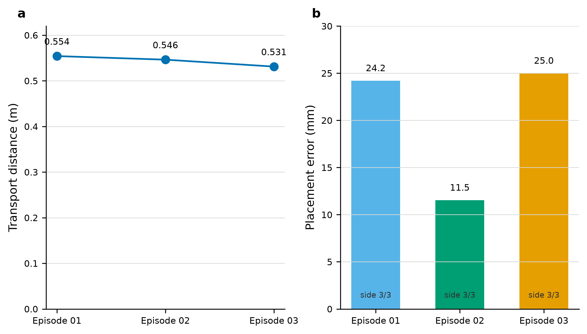

# Parcel Sorter ROCm

[](LICENSE)
[](https://rocm.docs.amd.com/)
[](https://www.bilibili.com/video/BV1Qkun6qEKn/)
[](https://huggingface.co/L2658183739/agengt-vla)

[English README](README.md) | [Bilibili 演示](https://www.bilibili.com/video/BV1Qkun6qEKn/) | [模型下载](https://huggingface.co/L2658183739/agengt-vla)

Parcel Sorter ROCm 在单张 AMD Radeon GPU 上运行 Genesis 包裹抓取、抬升、
长距离搬运和放置任务。当前主线是 **Agent 条件化 + v21 PI0.5 VLA 抓取模式
路由 + 脚本连续运动**。



## 1. 项目简介

任务从随机位置和物理参数生成包裹，要求机器人抓取并放入目标区域。仓库包含两种
Genesis 仿真机器人形态：

| 仿真形态 | 入口 | 已记录证据 |
| --- | --- | --- |
| 固定单臂 Franka Panda | `scripts/run_demo.sh` | 脚本参考控制器固定种子 8/10 |
| 全向轮式双臂 Bi-Franka | `scripts/smoke_mobile_bimanual_rocm.py` 与 mobile PI0.5 路线 | 底盘、双臂烟雾测试与 v21 混合路线 |

这里的“两种机器人”是两个仿真配置，不是两台真机，也不构成 Sim-to-Real 结果。

### 当前结果

| 路线 | 结果 | 正确解释 |
| --- | ---: | --- |
| Agent 条件化 + v21 模式路由 + 脚本连续运动 | 3 个交付成功回合 | 混合系统成功，不是纯 VLA |
| 三条交付轨迹 | 0.531-0.554 m，11.5-25.0 mm | v21 均以 3/3 票选择侧吸 |
| 严格纯 VLA | 0/3 | 学习策略未独立完成任务 |
| 脚本参考控制器 | 8/10 | 仅作为可复现工作站基线 |

三条成功轨迹的[全景与左腕原视频](videos/v21-agent-vla-hybrid-success/README.md)
已经随仓库提交，公开视频见 [Bilibili](https://www.bilibili.com/video/BV1Qkun6qEKn/)。

## 2. 开发过程

最初问题不是 loss 不下降，而是学习动作接近专家数值时仍可能越过笛卡尔步长、
接触力、IK 或工具指令边界。因此系统把职责明确拆开：

1. Responses Agent 在回合前读取一次结构化观测，只能生成目标、抓取类别和恢复意图。
2. v21 PI0.5 读取四路 RGB-D、68 维状态和任务文本，对抓取模式进行三次投票。
3. 确定性控制器在安全门下执行预抓取、吸附、抬升、运输、放置和释放。

Agent 不能发送关节、笛卡尔、吸盘或安全覆盖指令。v21 连续动作处于 shadow
模式，`applied_physics_steps=0`。因此三条视频必须写作 Agent+VLA 混合结果。

Radeon 上还记录了一次 2,800 update 的 SmolVLA 训练，loss 从 2.164 降到
0.056；这只证明训练实际运行过，不是当前 v21 的闭环成功率。训练日志、TensorBoard
导入视图和离线消融见 [训练证据](docs/TRAINING_EVIDENCE.md) 与
[消融结果](docs/ABLATION_RESULTS.md)。

## 3. 代码来源说明

| 组件 | 上游来源 | 本项目工作 |
| --- | --- | --- |
| 物理与渲染 | Genesis 1.2.3 | 包裹场景、相机、控制器、录像和 Radeon 流程 |
| 学习策略 | LeRobot 0.6.1 | PI0.5 adapter、动作合约、训练和评测适配 |
| 机器人资产 | Genesis Panda 与 Apache-2.0 Bi-Franka MJCF | 固定工位与原创全向移动底盘集成 |
| Agent | OpenAI-compatible Responses API | 严格 JSON schema、权限门和任务桥接 |

固定 revision 见 [UPSTREAM_LOCK.json](UPSTREAM_LOCK.json)，第三方许可证见
[THIRD_PARTY_NOTICES.md](THIRD_PARTY_NOTICES.md)，项目代码使用 [MIT](LICENSE)。

## 4. 团队分工

`2658183739` 负责问题定义、系统设计、实验执行、证据复核、文档和最终发布。
GPT-5.6 Luna/Codex Runtime 用于研发编排和代码审查，不是机器人控制器。本次成功
运行请求 `gpt-5.6-luna`，实际审计记录为 `gpt-5.5` fallback；仓库不保存 API Key。

## 5. 安装与运行

记录环境为 Linux、单张 `gfx1100` Radeon、ROCm 7.2.1、PyTorch 2.9.1 ROCm、
Genesis 1.2.3、LeRobot 0.6.1 和 Python 3.12。

### 先运行无需模型的参考 demo

```bash
source scripts/activate_radeon_env.sh
bash scripts/preflight_radeon.sh
bash scripts/run_demo.sh
```

### 下载完整模型

```bash
hf download L2658183739/agengt-vla --repo-type model \
  --local-dir models/agengt-vla

export PARCEL_PI05_BASE_MODEL="$PWD/models/agengt-vla/base/pi05-droid"
export PARCEL_PI05_V21_CHECKPOINT="$PWD/models/agengt-vla/adapters/v21"
```

### 运行 Agent+v21 混合路线

```bash
export OPENAI_API_KEY="<your-key>"

python scripts/plan_mobile_pi05_episode_with_agent.py \
  --config configs/mobile_pi05_v21_luna_agent_v1.json \
  --observation configs/mobile_pi05_agent_observation_side_box.json \
  --output outputs/v21-agent-plan.json

python scripts/build_agent_conditioned_demo_config.py \
  --source-config configs/mobile_pi05_v21_agent_hybrid_success_3_v1.json \
  --agent-plan outputs/v21-agent-plan.json \
  --output outputs/v21-agent-episodes.json \
  --shape box --max-episodes 3

python scripts/collect_mobile_suction_dataset_rocm.py \
  --config outputs/v21-agent-episodes.json \
  --output outputs/v21-agent-hybrid \
  --backend rocm --wrist-rgbd --audit-only \
  --smolvla-checkpoint "$PARCEL_PI05_V21_CHECKPOINT" \
  --policy-mode shadow --policy-hz 3 \
  --task-routing-authority agent_semantic_skill \
  --require-vla-grasp-mode \
  --record-media-all-episodes --record-wrist-video
```

### 数据集生成

数据集大文件不提交 GitHub。主要生成链如下：

| 文件 | 作用 |
| --- | --- |
| `configs/mobile_suction_collection_v1.json` | 定义物体、物理参数和 episode |
| `scripts/collect_mobile_suction_dataset_rocm.py` | 执行采集、保留失败、合并成功 shard |
| `scripts/evaluate_mobile_suction_lift_rocm.py` | 单回合仿真与全景/腕部 RGB-D 记录 |
| `src/parcel_sorter/dataset.py` | 写入同步状态、动作、任务、RGB 与深度 |
| `scripts/audit_dataset.py` | 训练前检查 metadata、统计量和动作合约 |

完整字段与生成命令见 [data/README.md](data/README.md)。

## 结果边界

- 所有任务结果均为 Genesis 仿真，不主张真机或 Sim-to-Real。
- 混合成功、脚本基线和严格纯 VLA 不能合并成一个成功率。
- 42 个离线样本只衡量动作包络合法性，不是 42 次任务成功。
- Agent 不直接操控机械臂，v21 在成功视频中只负责抓取模式路由。
