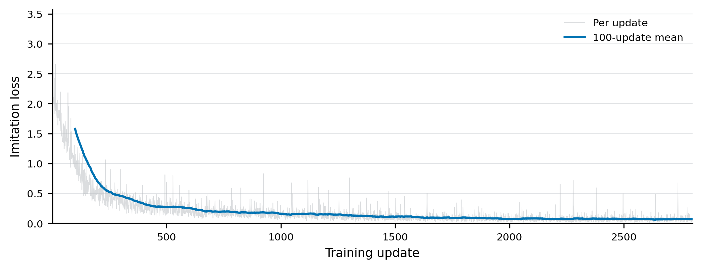
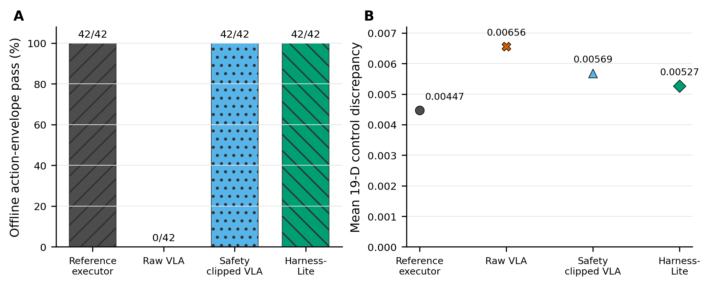

# Results / 结果

## Public demonstration / 公开视频

[Bilibili: BV1Qkun6qEKn](https://www.bilibili.com/video/BV1Qkun6qEKn/)

The public video presents the Agent-conditioned, v21 VLA-routed,
scripted-motion hybrid. The repository also retains all three source overview
and left-wrist streams under `videos/v21-agent-vla-hybrid-success/`.

公开视频展示 Agent 条件化 + v21 VLA 模式路由 + 脚本连续运动混合系统。仓库在
`videos/v21-agent-vla-hybrid-success/` 保留三条轨迹的全景和左腕原视频。

## Learned-policy measurements / 学习策略测量

| Controller and test / 控制器与测试 | Result / 结果 | Interpretation / 含义 |
| --- | ---: | --- |
| Raw VLA, offline action envelope / 原始 VLA 离线动作包络 | 0/42 | Raw actions exceed at least one execution limit / 至少越过一项执行边界 |
| Safety-clipped VLA, same offline test / 安全裁剪 VLA | 42/42 | Offline action validity only / 仅离线动作有效性 |
| Harness-Lite, same offline test | 42/42 | Offline action validity only / 仅离线动作有效性 |
| Agent-conditioned, v21 VLA-routed, scripted-motion hybrid | 3 delivered | Complete 0.531-0.554 m tasks; delivered clips are not an independent success-rate estimate / 完整长距离任务，交付视频数量不是独立成功率 |
| Strict pure VLA, closed loop / 严格纯 VLA 闭环 | 0/3 | Did not complete the task / 未完成任务 |

The offline rows are older action-contract diagnostics. They are not
task-success rates and are not merged with the v21 result.

离线行是早期动作合约诊断，不是任务成功率，也不与 v21 结果合并。

The new v21 row is a closed-loop task result with explicit hybrid attribution.
The Agent supplied task conditioning, the v21 PI0.5 mode head routed
`side_suction` by 3/3 vote, and a deterministic controller executed continuous
motion. See [v21 Agent + VLA hybrid results](V21_AGENT_VLA_HYBRID_RESULTS.md).

新增的 v21 行是带明确混合归因的闭环任务结果：Agent 提供任务条件，v21 PI0.5
模式头以 3/3 票选择 `side_suction`，确定性控制器执行连续运动。详情见
[v21 Agent + VLA 混合结果](V21_AGENT_VLA_HYBRID_RESULTS.md)。

## Training record / 训练记录

This is one 2,800-update SmolVLA run on a single Radeon GPU. The loss recorded
in the log falls from 2.164 to 0.056; the first-100 and last-100 means are
1.57606 and 0.07332. Mean throughput was 6.33 updates/s and reported peak GPU
memory was 2.32 GB. Because this is one run (`n=1`), the figure does not show
an uncertainty band.

这是单张 Radeon GPU 上一次完整的 2,800 update SmolVLA 训练。日志中的 loss
从 2.164 降至 0.056，前 100 次和后 100 次均值分别为 1.57606 与 0.07332；
平均速度为 6.33 updates/s，记录的显存峰值为 2.32 GB。该图只有一次运行
（`n=1`），因此不画误差带。

## Offline ablation / 离线消融

The left panel reports the same execution-envelope check as the table above.
The right panel adds the mean absolute component discrepancy against the
recorded reference action over the 19 control outputs; the 20th auxiliary
progress output is evaluated separately. The diagnostic averages heterogeneous
action fields and has no single physical unit. Harness-Lite has the lowest
value among the learned-action variants on these 42 samples.

左图对应上表的执行包络检查；右图比较前 19 个控制输出相对记录参考动作的分量平均
差异，第 20 个辅助阶段进度输出单独评估。该诊断量混合了不同类型的动作字段，没有
统一物理单位。Harness-Lite 在这 42 个样本的学习动作方案中数值最低。

Sources: `docs/RESULT_ATTRIBUTION.md`,
`evidence/training/pash-primitive-smolvla-2800step-offline-ablation-v1.json`,
`evidence/training/pash-primitive-smolvla-rocm-2800step-v1.log`, and
`videos/source_manifest.json`.
